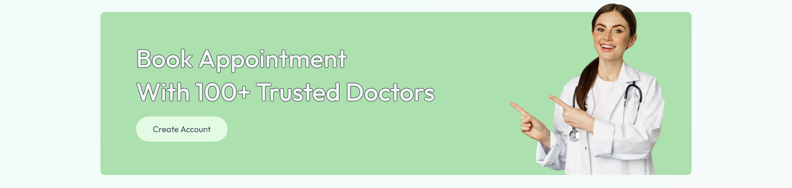
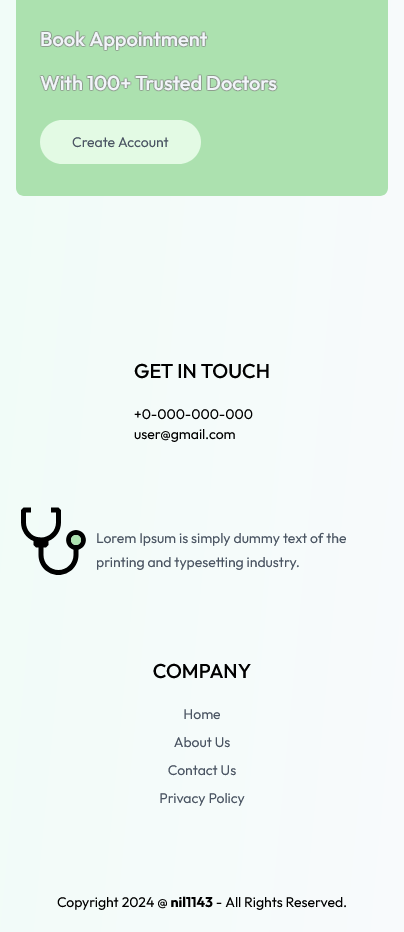
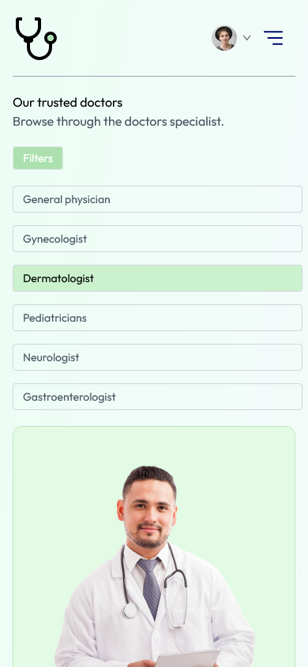
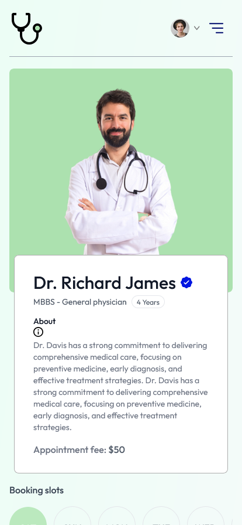

<h1 align="center">Doc Clinic</h1>

 The live link can be found here: [Doc Clinic](https://react-doc-appointment.onrender.com/)

 

## Contents
* [About The Project](#about-the-project)
    * [Built With](#build-with)
* [Project Goals and UX](#project-goals-and-ux)
    * [Project Goals](#Project-Goals)
    * [User Stories](#User-Stories)
* [Design](#Design)
    * [Colour Scheme](#Colour-Scheme)
* [Features](#Features)
    * [Features](#Features)
        * [Responsive View](#responsive-view)
    * [Future Features](#Future-Features)
* [Testing](#Testing)
    * [Accessibility Testing](#Accessibility-Testing)
    * [Manual Testing](#Manual-Testing)
* [Deployment](#Deployment)
    * [Cloning & Forking](#Cloning-&-Forking)
    * [Remote Deployment](#Remote-Deployment)

***

 

## About The Project

### Built With

[![React][React.js]][React-url] [![Tailwind][Tailwind]][Tailwind-url]

  

## Project Goals and UX

### Project Goals
* The Goal of the project is to make accessible and easy to navigate website

* For the learning purposes.

### User Stories

|Story No.|Story|
| ------------- | ------------- |
|1|As an user,   I want smoothly navigate between the sections  so that I can see the website content.   I know I am done when the user is navigated to the desired    sections after clicking Navbar item. |
|2|As an user,   I want to know about the company  so that I can ensure I am in the right place.   I know I am done when the when the user used navigation item   About which directed him to the About Us section. |
|3|As an user,   I want to browse the doctors  so that I can decide who suits to my diesase.  I know I am done when the user scrolled down the website   or been navigated from the Navbar to the Doctors section. |
|4|As an user,   I want to find a doctors by speciality  so that I can choose the doctor.  I know I am done when the user clicked sidebar  filter item  to filter doctors by specialization.. |
|5|As an user,   I want to check doctor info and booking calendar  so that I can schedule myself  I know I am done when the user click doctors card and it  directed him  to the doctors info. |
|6|As an user,   I want to clinic contact information  so that I can get the information I need.  I know I am done when the user clicked Contact in the navigation  so that directed him to Contact section. |

 

## Design

### Colour Scheme

 

## Features

### Responsive View

Desktop View - <b>CLICK</b> to see

#### -HOME

Navbar and Header - <b>CLICK</b> to see

 

Speciality Section - <b>CLICK</b> to see

 

Top Doctors - <b>CLICK</b> to see

 

Banner - <b>CLICK</b> to see

 

Footer - <b>CLICK</b> to see

 

#### -ALL DOCTORS

Doctors Page- <b>CLICK</b> to see

 -Filtered specialities

 

#### -ABOUT

About - <b>CLICK</b> to see

 

#### -CONTACT

Contact - <b>CLICK</b> to see

 

#### -DOCTOR PAGE 

Doctor Page - <b>CLICK</b> to see

 

#### -SIGNIN / LOGIN 

Signin / Login - <b>CLICK</b> to see

 

#### USER ACCOUNT

#### -My Profile

My Profile - <b>CLICK</b> to see

 

#### -My Appointments

My Appointments - <b>CLICK</b> to see

 

Mobile View - <b>CLICK</b> to see

#### -HOME

Home - <b>CLICK</b> to see

 

 

 

#### - TOGGLE NAVBAR

Navbar - <b>CLICK</b> to see

 

#### - ALL DOCTORS PAGE

All Doctors - <b>CLICK</b> to see

 

#### - ABOUT PAGE

About - <b>CLICK</b> to see

 

 

#### - CONTACT PAGE

Contact - <b>CLICK</b> to see

 

#### - DOCTOR INFO

Doctor info - <b>CLICK</b> to see

 

 

 

 

#### - SIGNUP / LOGIN

Signup / Login -<b>CLICK</b> to see

 

## Future Features
 

* Backend for Authentication and Booking system
* Stripe Payment Gateway
 

## Testing

### Accessibility Testing
#### Lighthouse

### Manual Testing
- I have tested that this page works in different web browsers.
- I have tested that the project is responsive and works with different device sizes. Looks good and functions as usual. 
- I have tested all links, internal and external. They go to the correct destination and open in the correct way. 
- I have tested that all text and fonts are readable and easy to understand.
- I have tested a navigation in the header to make sure it navigate you to correct sections.

## Deployment

### Cloning & Forking
#### Fork
1. On GitHub.com, navigate to the [nil1143/react-doc-appointment](https://github.com/nil1143/react-doc-appointment) repository.
2. In the top-right corner of the page, click Fork.
3. By default, forks are named the same as their parent repositories. You can change the name of the fork to distinguish it further.
4. Add a description to your fork.
5. Click Create fork.

#### Clone
1. Above the list of files click the button that says 'Code'.
2. Copy the URL for the repository.
3. Open Terminal. Change the directory to the location where you want the cloned directory.
4. Type git clone, and then paste the URL.
5. Press Enter.

### Remote Deployment
 The site was deployed to Github pages. If you have forked/cloned the repository the steps to deploy are:
 1. On GitHub.com, navigate to your repository.
 2. Navigate to the settings tab.
 3. Click on the tab called 'pages' on the left hand side.
 4. From the source drop down list under the heading Build and deployment, select main.
 5. The page will hten provide the link to the website.
 
 
 
 

[![Github][Github]][Github-url] [![LinkedIn][LinkedIn]][Linkedin-url]

<!-- MARKDOWN LINKS & IMAGES -->
[Mongodb]: https://img.shields.io/badge/-MongoDB-black.svg?style=for-the-badge&logo=mongodb&colorB=555
[Mongodb-url]: https://www.mongodb.com/atlas
[Express]: https://img.shields.io/badge/-express-white.svg?style=for-the-badge&logo=express&colorB=333
[Express-url]: https://expressjs.com/
[React.js]: https://img.shields.io/badge/React-20232A?style=for-the-badge&logo=react&logoColor=61DAFB
[React-url]: https://reactjs.org/
[Node]: https://img.shields.io/badge/node-black.svg?style=for-the-badge&logo=nodedotjs&colorB=333
[Node-url]: https://nodejs.org/
[Github]: https://img.shields.io/badge/github-black.svg?style=for-the-badge&logo=github&colorB=333
[Github-url]: https://github.com/nil1143
[LinkedIn]: https://img.shields.io/badge/-LinkedIn-black.svg?style=for-the-badge&logo=linkedin&colorB=555
[LinkedIn-url]: https://www.linkedin.com/in/tomasz-nilipiuk-b5b88a239/
[Tailwind]: https://img.shields.io/badge/Tailwind-blue.svg?style=for-the-badge&logo=tailwind-css&colorB=EFEFFF
[Tailwind-url]: https://tailwindcss.com/